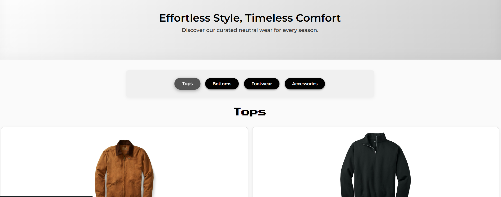

## ✨ Features

- **Product Catalog**: Display a variety of products with images and descriptions.
- **User Interaction**: Add products to the cart and proceed to checkout.
- **Responsive Design**: Optimized for both desktop and mobile devices.

## 🚀 Installation

1. Clone the repository:

   ```bash
   git clone https://github.com/zingerw1/E-commerce-Site.git

2. Navigate into the project folder:
cd E-commerce-Site

3.Open index.html in your browser.

🌐 Demo
Explore the live version: https://zingerw1.github.io/E-commerce-Site/

## 🖼 Screenshots
**Landing Page:**  


**Collection Page:**  



https://zingerw1.github.io/E-commerce-Site/
