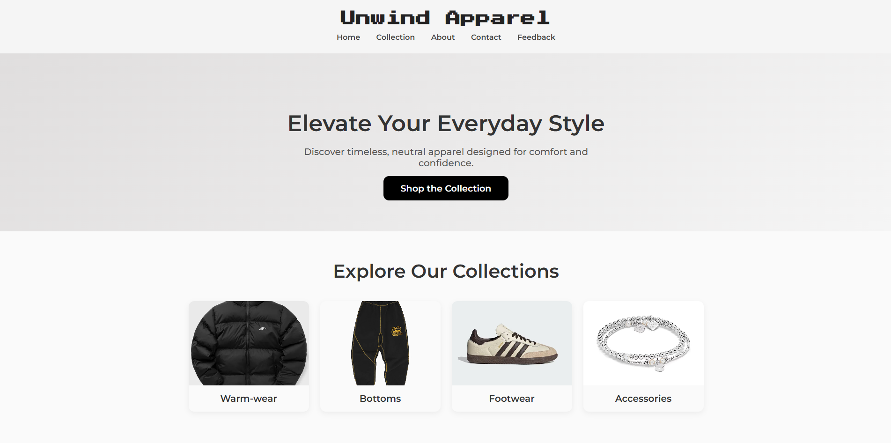

🌐 Demo
Explore the live version: https://zingerw1.github.io/E-commerce-Site/

# Unwind Apparel an E-commerce Site 🛒

A clean and responsive e-commerce website built with vanilla **HTML**, **CSS**, and **JavaScript**.  
Ideal for showcasing products and learning front-end development.

## ✨ Features

- **Product Catalog**: Display a variety of products with images and descriptions.
- **User Interaction**: Clean and easy to navigate , use of modern features and minimlastic colors.
- **Responsive Design**: Optimized for both desktop and mobile devices.

## 🚀 Installation

1. Clone the repository:

   ```bash
   git clone https://github.com/zingerw1/E-commerce-Site.git

2. Navigate into the project folder:

   ```bash
   cd E-commerce-Site

3. Open index.html in your browser.


## 🖼 Screenshots
**Landing Page:**  


**Collection Page:**  


**About Us Page:**  


**Feedback Form Page:**  

